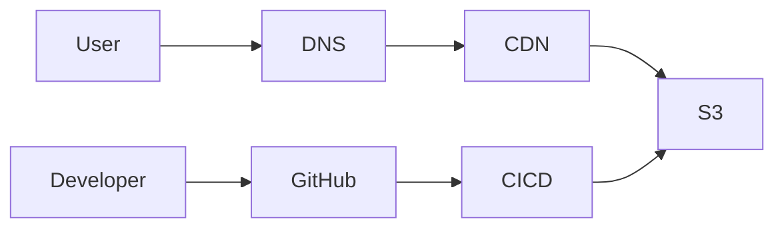

# Static Website Cloud Architecture

## Architecture Overview

## Component Responsibilities

## Route 53

This provides DNS resolution for the website domain.

## CloudFront

This acts as the CDN and delivers cached content from edge locations closer to users.

## S3

This stores the static website files such as HTML, CSS, JavaScript, and images.

## GitHub

This stores the source code and provides version control.

## CI/CD

This automates the process of deploying approved changes from GitHub to S3.

## Architecture Decision

S3 and CloudFront are preferred over EC2 because this application is a static website and does not require a continuously running server. S3 provides object storage while CloudFront distributes the content globally through edge locations.
