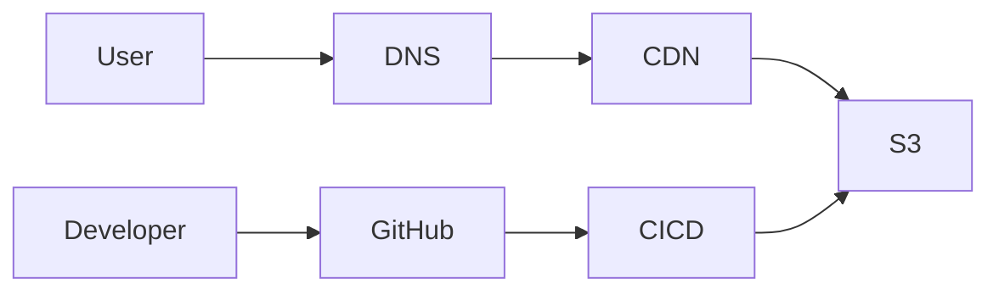
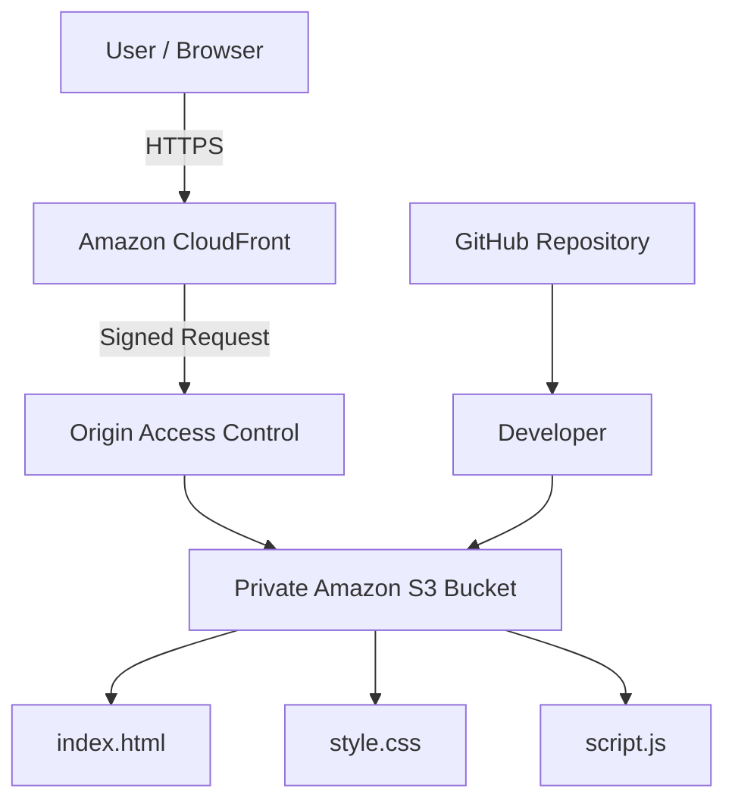

# Static Website Cloud Architecture

## Architecture Overview

## Component Responsibilities

## Route 53

This provides DNS resolution for the website domain.

## CloudFront

This acts as the CDN and delivers cached content from edge locations closer to users.

## S3

This stores the static website files such as HTML, CSS, JavaScript, and images.

## GitHub

This stores the source code and provides version control.

## CI/CD

This automates the process of deploying approved changes from GitHub to S3.

## Architecture Overview

S3 and CloudFront are preferred over EC2 because this application is a static website and does not require a continuously running server. S3 provides object storage while CloudFront distributes the content globally through edge locations.

## Architecture Overview

### Why S3?

Amazon S3 provides durable object storage for the static website assets.

### Why CloudFront?

CloudFront provides CDN distribution and caching, reducing latency for users.

### Why OAC?

Origin Access Control allows CloudFront to securely retrieve objects from the private S3 bucket without making the bucket publicly accessible.

### Why HTTPS?

HTTPS protects traffic between the user's browser and CloudFront.

### Why keep S3 private?

Direct public access to the S3 bucket is unnecessary because CloudFront acts as the public delivery layer.
